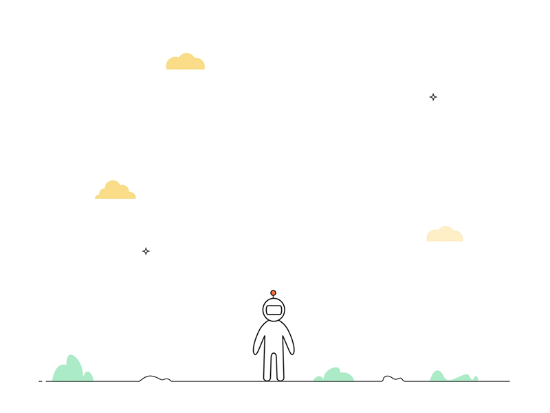

<style>
  @keyframes sparkle {
    0%, 100% { opacity: 0; transform: scale(0); }
    50% { opacity: 1; transform: scale(1); }
  }
  
  @keyframes twinkle {
    0%, 100% { opacity: 0.3; }
    50% { opacity: 1; }
  }
  
  @keyframes float {
    0%, 100% { transform: translateY(0px); }
    50% { transform: translateY(-20px); }
  }
  
  .sparkle-bg::before {
    content: '';
    position: fixed;
    top: 0;
    left: 0;
    width: 100%;
    height: 100%;
    background-image: 
      radial-gradient(2px 2px at 20px 30px, #00FFB3, rgba(0, 255, 179, 0)),
      radial-gradient(2px 2px at 60px 70px, #00CED1, rgba(0, 206, 209, 0)),
      radial-gradient(1px 1px at 50px 50px, #00FFD4, rgba(0, 255, 212, 0)),
      radial-gradient(1px 1px at 130px 80px, #00FFB3, rgba(0, 255, 179, 0)),
      radial-gradient(2px 2px at 90px 10px, #00CED1, rgba(0, 206, 209, 0));
    background-repeat: repeat;
    background-size: 200px 200px;
    animation: twinkle 3s infinite, float 6s infinite;
    pointer-events: none;
    z-index: 1;
  }
</style>

<div class="sparkle-bg" style="background: linear-gradient(135deg, #0a0a0a 0%, #0d1b1f 100%); padding: 20px; border-radius: 15px; position: relative; z-index: 2;">

<p align="center">
  
</p>


# Hi, Myself Rupayan Dey

<p align="center">
  
</p>


I'm a passionate developer with expertise in full-stack development ( HTML, CSS, JavaScript, React, Nextjs), web technologies, and software engineering best practices. I love building scalable applications and contributing to open-source projects.

---

## Professional Summary

| Course | Institution | Timeline |
|-----|-----|---|
| Secondary Examination |Krishnapur Adarsha Vidhyamandir | 2021-2022 |
| Higher Secondary Examination | Bidhannagar Government High School | 2023-2024 |
| Bachelor of Technology in Computer Science Engineering specialization with Artificial Intelligence And Mechine Learning | Techno Main Salt Lake | 2024-2028 |


---

**Key Strengths:**
- 💡 Problem-solving & Algorithm Design
- 🚀 Full-Stack Development
- 🔧 DevOps & System Design
- 📚 Clean Code & Best Practices
- 🤝 Team Collaboration

---

## GitHub Stats

<div align="center">
  <a href="https://github.com/valiantProgrammer">
    
  </a>
  <br />
  <strong><a href="https://github.com/valiantProgrammer?tab=repositories" style="color: #00FFD4;">View My Repositories →</a></strong>
</div>

### Streak Stats
<div align="center">


</div>

### Daily Activity

<div align="center">
  <strong><a href="https://github.com/valiantProgrammer" style="color: #00FFD4;">View my GitHub activity →</a></strong>
</div>

---

## 💻 Languages I Know

<div align="center" style="border: 2px solid #00FFD4; border-radius: 15px; padding: 20px; background-color: #0f1d22; margin: 20px 0;">


</div>

---


## 🛠️ Tech Stack

<table style="width: 100%; border-collapse: collapse; margin: 20px 0;">
<tr>
<td style="border: 2px solid #00FFD4; border-radius: 15px; padding: 20px; text-align: center; width: 50%; background-color: #0f1d22;">

### Frontend


</td>
<td style="border: 2px solid #00FFD4; border-radius: 15px; padding: 20px; text-align: center; width: 50%; background-color: #0f1d22;">

### Backend


</td>
</tr>
<tr>
<td style="border: 2px solid #00FFD4; border-radius: 15px; padding: 20px; text-align: center; width: 50%; background-color: #0f1d22;">

### Mobile


</td>
<td style="border: 2px solid #00FFD4; border-radius: 15px; padding: 20px; text-align: center; width: 50%; background-color: #0f1d22;">

### ML/AI


</td>
</tr>
<tr>
<td style="border: 2px solid #00FFD4; border-radius: 15px; padding: 20px; text-align: center; width: 50%; background-color: #0f1d22;">

### Databases


</td>
<td style="border: 2px solid #00FFD4; border-radius: 15px; padding: 20px; text-align: center; width: 50%; background-color: #0f1d22;">

### Tools & Platforms





</td>
</tr>
</table>

---

## 🎯 Featured Projects

### 1.[Civic-Saathi](https://github.com/valiantProgrammer/Civic-Issues)
**Description:** Report & track civic issues in your community. Connect citizens with authorities for faster resolution.

```
Tech Stack: Next.js, MongoDB, MobileNetV2, 
```

**Highlights:**
- Responsive Design
- Real-time Updates
- Authentication System

**Active Link:**
[Civic-Saathi](https://civic-issues-pearl.vercel.app/)

```code
Note: The active link may take some time to open because of the free instance of the deploy server.
```

### 2. [Belle Mart](https://github.com/valiantProgrammer/E-commerce)
**Description:** A full-stack e-commerce application with Python backend API and Next.js frontend. Features include secure user authentication with email OTP verification, comprehensive product catalog with search and filtering, shopping cart functionality, complete checkout system, order management, and responsive mobile design. Database-driven with MongoDB.  

**Tech Stack:** Next.js, Python, Razor-pay.

**Highlights:**
- End to End project
- Database Optimization
- Unit Testing
- Payment Gateway Implementation

**Active Link:**
[Belle Mart](https://civic-issues-pearl.vercel.app/)


```code
Note: The active link may take some time to open because of the free instance of the deploy server.
```


---

## 🏆 Achievements & Certifications

- 🎓 **Certification Name** - Issuing Organization (Year)
- 🥇 **Achievement** - Description
- 🚀 **Milestone** - Details

---

## 📚 Latest Blog Posts

<!-- BLOG-POST-LIST:START -->
- [Blog Post Title](https://yourblog.com)
- [Another Blog Post](https://yourblog.com)
- [Technical Article](https://yourblog.com)
<!-- BLOG-POST-LIST:END -->

---

## 📞 Get In Touch

[](https://www.linkedin.com/in/rupdey/)
[](https://x.com/Rupayan_Dey_)
[](mailto:rupayandey134@gmail.com)
[](https://yourportfolio.com)

---

## 📊 Additional Stats


---

<p align="center">
  
</p>

</div>
# valiantProgrammer

